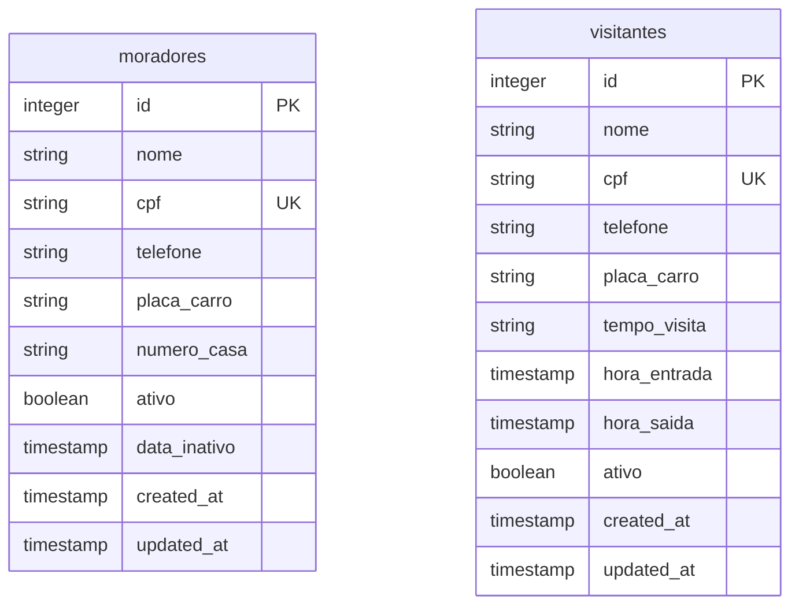

# Acesso Seguro — Sistema de Controle de Portaria Integrado

**Objetivo da solução:**
O **Acesso Seguro** resolve a vulnerabilidade e a falta de rastreabilidade no controle de acessos em condomínios residenciais. Ele gerencia o cadastro e status (ativo/inativo) de moradores e visitantes, registrando placas de veículos, número de residências, horários exatos de entrada/saída e tempos de visita para fins de auditoria e segurança.

**Tecnologias utilizadas:**
* **Front-end:** React (v18.3.1) e Tailwind CSS (via CDN) integrado com a biblioteca `@inertiajs/react` (v1.2.0) para comunicação de Single Page Application (SPA).
* **Back-end:** Node.js com Express (v4.19.2) e `express-session` para gerenciamento de estados, mensagens flash e erros.
* **Banco de Dados:** PostgreSQL estruturado com Sequelize ORM (v6.37.3) para modelagem física, abstração de dados e sincronização em runtime.
* **Infraestrutura/Jobs:** Node-Cron (v4.3.0) para automação de tarefas em segundo plano (limpeza diária de moradores inativos).

**Arquitetura adotada:**
A aplicação adota a arquitetura **MVC (Model-View-Controller)** adaptada para Single Page Applications (SPA) Server-Driven via protocolo Inertia.js, estendida por uma camada de **Data Access (DA)** para isolamento absoluto de dados.

* **Routers:** [src/routers/](file:///C:/projetos/acesso-seguro-1/src/routers/) — Mapeia endpoints HTTP diretamente para ações nos controladores. Veja detalhes de design em [routers/README.md](file:///C:/projetos/acesso-seguro-1/src/routers/README.md).
* **Controllers:** [src/controllers/](file:///C:/projetos/acesso-seguro-1/src/controllers/) — Orquestra a lógica de negócio, sanitiza dados de entrada e direciona o fluxo SPA. Veja detalhes de design em [controllers/README.md](file:///C:/projetos/acesso-seguro-1/src/controllers/README.md).
* **Data Access (DA):** [src/data_access/](file:///C:/projetos/acesso-seguro-1/src/data_access/) — Abstrai e encapsula chamadas diretas ao banco de dados e ao ORM. Veja detalhes de design em [data_access/README.md](file:///C:/projetos/acesso-seguro-1/src/data_access/README.md).
* **Models:** [src/models/](file:///C:/projetos/acesso-seguro-1/src/models/) — Define o esquema físico das tabelas relacionais do banco via Sequelize. Veja detalhes de design em [models/README.md](file:///C:/projetos/acesso-seguro-1/src/models/README.md).
* **Views:** [src/views/](file:///C:/projetos/acesso-seguro-1/src/views/) — Contém os componentes SPA React e o bootstrap do Inertia.js. Veja detalhes de design em [views/README.md](file:///C:/projetos/acesso-seguro-1/src/views/README.md).
* **Jobs:** [src/jobs/](file:///C:/projetos/acesso-seguro-1/src/jobs/) — Processamentos agendados e automações secundárias via node-cron. Veja detalhes de design em [jobs/README.md](file:///C:/projetos/acesso-seguro-1/src/jobs/README.md).
* **Middleware:** [src/middleware/](file:///C:/projetos/acesso-seguro-1/src/middleware/) — Interceptadores de infraestrutura e tráfego de dados. Veja detalhes de design em [middleware/README.md](file:///C:/projetos/acesso-seguro-1/src/middleware/README.md).

---

### Padrões de Projeto (Design Patterns)

* **Data Access Object (DAO) / Repository Pattern:**
  * *Onde foi utilizado:* [morador.da.js](file:///C:/projetos/acesso-seguro-1/src/data_access/morador.da.js) e [visitante.da.js](file:///C:/projetos/acesso-seguro-1/src/data_access/visitante.da.js).
  * *Por que foi utilizado:* Cria uma barreira de abstração sobre o ORM Sequelize. Se no futuro for necessário migrar para outro ORM (ex: Prisma, Knex) ou banco de dados NoSQL, a lógica dos controladores permanece intocada.
* **Singleton:**
  * *Onde foi utilizado:* Exportações padrão dos controladores, como [morador.controller.js](file:///C:/projetos/acesso-seguro-1/src/controllers/morador.controller.js) e das classes DA.
  * *Por que foi utilizado:* Assegura que apenas uma única instância em memória de cada classe controladora e de persistência gerencie as requisições em todo o runtime do Express, otimizando o consumo de recursos da aplicação Node.js.
* **Active Record:**
  * *Onde foi utilizado:* Modelos [morador.model.js](file:///C:/projetos/acesso-seguro-1/src/models/morador.model.js) e [visitante.model.js](file:///C:/projetos/acesso-seguro-1/src/models/visitante.model.js).
  * *Por que foi utilizado:* É o padrão de persistência do Sequelize. Permite que cada entidade represente tanto um registro da tabela quanto os métodos de CRUD para salvar ou excluir o próprio registro diretamente na instância, agilizando o fluxo de desenvolvimento.
* **Middleware Pattern:**
  * *Onde foi utilizado:* [inertia.js](file:///C:/projetos/acesso-seguro-1/src/middleware/inertia.js).
  * *Por que foi utilizado:* Estende o pipeline de requisições HTTP do Express para injetar a renderização híbrida baseada nos headers (`X-Inertia`) de forma transparente e reutilizável.

---

### Banco de Dados

* **Estrutura:**
  * Tabela `moradores`: Armazena informações dos residentes. Campos principais: `id` (PK, autoincremento), `nome`, `cpf` (único), `telefone`, `placa_carro`, `numero_casa`, `ativo` (booleano), `data_inativo` (para fins de auditoria e limpeza), `created_at`, `updated_at`.
  * Tabela `visitantes`: Armazena o fluxo de entradas e saídas na portaria. Campos principais: `id` (PK, autoincremento), `nome`, `cpf` (único), `telefone`, `placa_carro`, `tempo_visita`, `hora_entrada` (default data atual), `hora_saida` (nulo por padrão, preenchido no check-out), `ativo` (booleano), `created_at`, `updated_at`.

---

### API REST

* **Explicação:**
  As rotas HTTP seguem o padrão RESTful clássico utilizando verbos semânticos (GET para listagem e formulários, POST para inserções e PUT para atualizações e deleções lógicas).
  
  O diferencial está na camada de resposta: a API utiliza o protocolo Inertia.js. Caso a requisição venha de dentro da SPA React, a API responde diretamente com um payload JSON estruturado contendo a página e suas propriedades (props). Caso a requisição seja um acesso direto pelo navegador, a API intercepta a chamada e renderiza o HTML básico que inicializa o cliente React.
  
  Validações de segurança e restrições de unicidade de dados (como duplicidade de CPF) são tratadas no back-end e propagadas ao front-end de forma assíncrona através de compartilhamento de erros de sessão.

---

### Dificuldades Encontradas

* **Implementação do Protocolo Inertia sem Framework:** Construir um middleware Inertia.js customizado no Express sem recorrer a adaptadores complexos de framework, exigindo o gerenciamento manual do cabeçalho `X-Inertia` e a renderização do JSON de forma condicional em relação à string de template HTML da SPA.
* **Sincronização de Estados Concorrentes:** Lidar com a transição de estados de sessão (mensagens flash e erros) em um ambiente híbrido (SPA Client-Side com roteamento controlado pelo Express Server-Side), garantindo que erros de validação sejam descartados após o consumo da rota subsequente.
* **Conectividade e Migrações em Runtime:** Adoção de inicialização do banco (`setup.js` em nível de postgres nativo) executando comandos DDL de banco antes do Sequelize ORM sincronizar os modelos em tempo de execução, para garantir a consistência das tabelas em bancos vazios.
